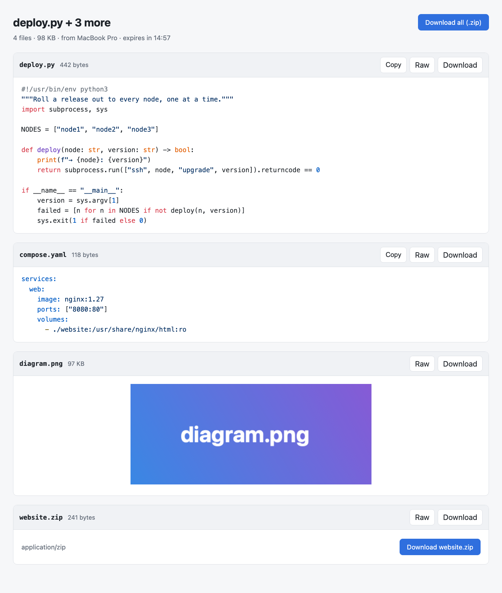
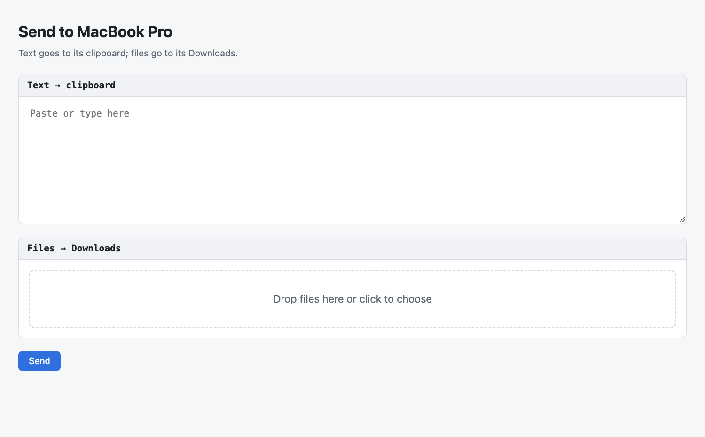

# MacGist

**Local gists for your Mac.** Highlight text in any app, or select files in
Finder, then right-click → **Copy to Gist**. A link lands on your clipboard.
Paste it on any machine on your network to open a gist page. It stops working
after **15 minutes**, or whatever lifetime you set.

The other direction works too. Other machines can push text onto the Mac's
clipboard and drop files into its Downloads with one `curl`.

Nothing leaves your network. MacGist serves everything itself over HTTP on
your LAN. There is no cloud service and no account.



- [Install](#install)
- [Sharing: Mac → network](#sharing-mac--network)
- [Receiving: network → Mac](#receiving-network--mac)
- [Menu bar](#menu-bar)
- [Settings](#settings)
- [Security model](#security-model)
- [Troubleshooting](#troubleshooting)
- [Development](#development)

## Install

### Download

Get `MacGist.zip` from the [latest release](https://github.com/glennswest/macgist/releases/latest),
unzip it and move `MacGist.app` to `/Applications`.

The app is not notarized, so macOS blocks it the first time. Either open
**System Settings → Privacy & Security** and click **Open Anyway** for MacGist,
or remove the quarantine flag:

```sh
xattr -dr com.apple.quarantine /Applications/MacGist.app
open /Applications/MacGist.app
```

### Build from source

You need macOS 13 or later and Xcode (or the Swift 5.10+ command-line tools).

```sh
git clone https://github.com/glennswest/macgist.git
cd macgist
./scripts/install.sh
```

`install.sh` builds a universal, ad-hoc-signed `MacGist.app`, installs it to
`/Applications` (or `~/Applications`), registers its Services and launches it.
A link icon appears in the menu bar. The app has no Dock icon.

The first time, macOS may ask:

- **Notifications**: allow, so you see when a link is copied or something arrives.
- **Find devices on your local network**: allow, so senders are named
  (`From buildbox`) rather than shown by IP. It's optional.

To start MacGist at login, use **Open at Login** in its menu. Opening the app
again (from Spotlight or Finder) shows its **Settings** window.

## Sharing: Mac → network

### Copy to Gist

| Where | Do this |
|---|---|
| Any app with selectable text | Highlight text → right-click → **Services → Copy to Gist** |
| Finder | Select files and/or folders → right-click → **Services → Copy to Gist** |
| Anything you've copied | Menu bar icon → **Copy to Gist from Clipboard** |
| Terminal | `open -a MacGist file1 file2 …` |

You get a notification and the link is on your clipboard:

```
http://192.168.1.20:8642/g/jPWoSln2EfJ8MfdE_Iqlzg
```

If **Copy to Gist** isn't in the menu, turn it on in **System Settings →
Keyboard → Keyboard Shortcuts → Services** (under *Text* and *Files and
Folders*). You can give it a keyboard shortcut there too.

### What the link shows

**In a browser** it opens a gist page:

- Text and code are shown inline with syntax highlighting and a **Copy** button.
- Images are shown inline.
- Anything else gets a download card.
- Every file has **Raw** and **Download** links, and **Download all (.zip)** bundles the lot.
- A countdown shows the time left. Once it expires the link returns "This gist has expired".

**From a terminal:**

```sh
curl http://192.168.1.20:8642/g/<token>            # one-file gist: the file itself
curl http://192.168.1.20:8642/g/<token>            # several files: a list of raw URLs + the zip URL
curl -O http://192.168.1.20:8642/g/<token>/raw/0/notes.md
curl -C - -O http://…/g/<token>/zip/project.zip    # downloads resume (Range support)
```

Notes:

- **Folders** are zipped when you share them.
- **Files** are served from where they are, not copied, so edits within the 15 minutes show up.
- **Text you highlight** becomes `snippet.txt`.

## Receiving: network → Mac

Other machines can send to your Mac with a shared **inbox token**. Get it from
the menu: **Copy Inbox Token**, or **Copy Send-to-Mac Link** for the browser page.

### From a browser

Open `http://<mac-ip>:8642/in/<token>/`. Paste text, or drop files, then press **Send**:



### From a terminal

```sh
MAC=http://192.168.1.20:8642/in/$(cat ~/.config/macgist-token)

curl -s $MAC/ping                                  # 200 when the Mac is reachable

# Text → the Mac's clipboard (204). ?title= is shown in the notification.
make 2>&1 | tail -50 | curl --data-binary @- "$MAC/clipboard?title=Build%20log"

# Files → ~/Downloads/From <sender>/ on the Mac (201 + JSON)
curl -T report.pdf $MAC/
tar cz logs/ | curl -T - $MAC/logs.tgz             # streamed uploads work too
```

A file upload replies with where the file went:

```json
{"bytes":48213,"saved":"/Users/you/Downloads/From buildbox/report.pdf"}
```

Handy shell helpers for the sending machine:

```sh
# ~/.bashrc on the other machine
MACGIST=http://192.168.1.20:8642/in/$(cat ~/.config/macgist-token 2>/dev/null)
tomac()   { if [ $# -eq 0 ]; then curl -s --data-binary @- "$MACGIST/clipboard"; else for f; do curl -s -T "$f" "$MACGIST/"; echo; done; fi; }
# usage:  echo hi | tomac        tomac file1 file2
```

What happens on the Mac:

- **Text** goes straight onto the clipboard, with a "Copied from buildbox" notification.
- **Files** land in `~/Downloads/From <sender>/` (the folder is configurable) and are never overwritten (`name (2).ext`). Click the notification to show the file in Finder.
- The **last five arrivals** are listed in the menu. Click a text item to copy it again, or a file item to show it in Finder.
- `<sender>` is the sender's reverse-DNS short name (`buildbox.example.lan` → `buildbox`), or its IP if it has no name.

## Menu bar

| Item | What it does |
|---|---|
| *Serving on 192.168.1.20:8642* | Status of the built-in server |
| *also 10.0.0.5:8642 (en1)* | Other addresses the Mac can be reached on |
| Active gists | Title, minutes left, hit count. Submenu: **Copy Link**, **Copy Link via** another address, **Open in Browser**, **Extend**, **Revoke** |
| **Revoke All** | End every gist now |
| **Copy to Gist from Clipboard** | Gist whatever text or files you've copied |
| **Gist Lifetime** | Quick pick: 5 min to 1 day, or **Custom…** |
| **Receive from Network** | Turn the inbox on or off (off: every `/in/…` request is refused) |
| **Copy Send-to-Mac Link** / **Copy Inbox Token** | For setting up senders |
| **Reset Inbox Token** | Issue a new token; the old one stops working immediately |
| Recent arrivals | Copy again (text) or show in Finder (file) |
| **Settings…** (⌘,) | Everything below |
| **Open at Login**, **Quit** | Quitting ends all gists; the inbox token is kept |

## Settings

Nothing about your network is hard-coded. Open **Settings…** from the menu
(or open the app again). Changes apply immediately: a port change restarts the
server, and links always use the Mac's *current* address, so it keeps working
when you move between networks.

| Setting | Default | Notes |
|---|---|---|
| Gist lifetime | 15 min | 1 minute to 7 days. Live gists can be extended from their menu. |
| Inline preview up to | 1024 KB | Bigger text files get a download card. |
| Syntax highlighter | highlight.js on cdnjs | Loaded by the viewer's browser. Point it at your own copy, or leave it empty to turn highlighting off (pages then need no internet). |
| Port | 8642 | 1024 to 65535. |
| Address in links | Automatic | **Automatic** uses the interface with the default route. You can also pick a specific interface (stays correct when its IP changes), the Bonjour name (`Mac.local`), or a custom host name or IP. |
| Receive from the network | On | Off: every `/in/…` request is refused. |
| Save files in | `~/Downloads` | Each sender gets a `From <sender>` folder inside it. |
| Largest file | 1024 MB | |
| Largest clipboard text | 1024 KB | |
| Accept senders from | Any private network | **Any private network** (10.x, 172.16–31.x, 192.168.x, so routed subnets work), **This Mac's networks only** (follows network changes), or a list of CIDRs. |
| Inbox token | random | Copy or reset it. |

All settings are ordinary user defaults, so you can also script them. The app
picks up changes made outside it straight away:

```sh
D=com.glennswest.macgist
defaults write $D lifetimeMinutes -int 60
defaults write $D port -int 8642
defaults write $D host ""                   # "" automatic · "iface:en1" · "bonjour" · "mac.example.lan"
defaults write $D inlinePreviewKB -int 1024
defaults write $D highlightURL ""           # empty = no highlighting
defaults write $D receive -bool true
defaults write $D receiveFolder "~/Inbox"   # empty = ~/Downloads
defaults write $D maxUploadMB -int 1024
defaults write $D clipboardLimitKB -int 1024
defaults write $D inboxScope private        # private · local · custom
defaults write $D inboxSubnets -array 192.168.0.0/16 10.1.0.0/16   # used when inboxScope is custom
```

| File | Purpose |
|---|---|
| `~/Library/Application Support/MacGist/inbox-token` | The inbox token (mode 0600) |
| `<receive folder>/From <sender>/` | Received files |
| `$TMPDIR/MacGist/` | Zips and snippets for live gists; removed on expiry and on launch |

## Security model

MacGist is built for a trusted home or office LAN. It is not meant to be
exposed to the internet.

**Gists (outbound)**
- Each gist URL contains a 128-bit random token and expires after 15 minutes. There's no index, so a gist can't be found without its link.
- Anyone who has the link can read the gist until it expires or is revoked. The traffic is plain HTTP, so treat links like you would a message on your LAN.
- Raw text, including `.html` and `.svg`, is served as `text/plain` with `nosniff`, so a shared file can never run as a web page.

**Inbox (inbound)**
- Every request needs the shared token, which is compared in constant time.
- The sender's address must be on a private network: by default any RFC 1918 range (10.x, 172.16–31.x, 192.168.x). You can narrow this to the Mac's own subnets or to a list. Loopback is always allowed.
- Every refusal gets the same `403`, so a prober can't tell which check failed.
- Uploads are capped (by default 1 GiB per file and 1 MiB of clipboard text, which must be UTF-8).
- Filenames are reduced to a safe basename (no paths, no leading dots, no control characters), and files are only written inside `<receive folder>/From <sender>/`.
- **Receive from Network** turns the inbox off entirely, and **Reset Inbox Token** revokes every sender at once.

## Troubleshooting

| Symptom | Fix |
|---|---|
| No **Copy to Gist** in the right-click menu | Enable it in System Settings → Keyboard → Keyboard Shortcuts → Services. Or run `/System/Library/CoreServices/pbs -update` and relaunch Finder. |
| Link doesn't open from another machine | Check the menu says *Serving on …*. Check the macOS firewall allows MacGist. Make sure both machines are on the same network. |
| Menu shows *Server failed* | Another app is using the port. Pick another in **Settings → Port**. |
| Link has the wrong address (VPN, several networks) | Use **Copy Link via …** in the gist's menu, or set **Settings → Address in links**. |
| Senders appear as IPs, not names | Allow MacGist in System Settings → Privacy & Security → Local Network, or add PTR records for the senders. |
| `403` from `/in/…` | Wrong or reset token, a sender outside **Accept senders from**, or **Receive from Network** is off. |
| `413` | Upload over the cap. Raise it in **Settings → Receiving**, or send big text as a file. |

## Development

```sh
swift build
swift test                                   # 37 tests, including end-to-end server tests
./scripts/build-app.sh                       # → build/MacGist.app
swift scripts/perform-service.swift text "hello"         # call the installed service like a right-click would
swift scripts/perform-service.swift files a.txt folder/
```

Layout:

- `Sources/MacGistCore`: everything testable.
  - `Gist`/`GistStore`: live gists in memory.
  - `GistBuilder`/`Zipper`: turn text and files into a gist.
  - `HTTPServer`: Network.framework, HTTP/1.1, Range, chunked uploads.
  - `GistPage`: HTML pages.
  - `Inbox`/`ChunkedDecoder`: the receive side.
  - `LocalAddress`: LAN address and subnets.
- `Sources/MacGist`: the menu-bar app, the Services entry point, notifications.
  - `Prefs`: every setting, with its key, default and validation.
  - `SettingsView`: the Settings window.
- `Resources/Info.plist`: declares the **Copy to Gist** service (`NSServices`) for both text and files.

Changes are tracked in [CHANGELOG.md](CHANGELOG.md).

## License

[MIT](LICENSE)
